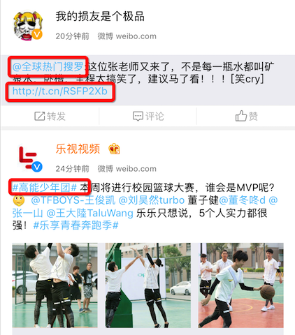

# RELabel

## 框架的作用

1. 用于识别Label中的@用户-话题##-链接
2. 识别自定义字符串 "协议"、"办法" 等等

框架地址:https://github.com/xiaoyouPrince/RELabel

**请使用Swift版，OC版本目前遗留一些Bug，最近比较忙未完全修正，尽快修正**
每天被推着走的感觉可不好，明天开始写runloop和真机打包发布什么的。。。

## 使用效果

* 如图所示
* 并且可以监听点击
* 

## 使用方式

- 导入框架
  - 直接将RELabel.swift拖入项目
- 将UIlabel修改为RELabel
- 按照下列方式监听点击即可
- swift使用和监听方式

```swift


      /// 设置匹配完成后的文字颜色（可选）
      //  label.matchTextColor = UIColor.red


      /// 匹配类型（可选） -- 默认 用户、连接、话题
      /**
       NoneTapHandler = 0   取消所有默认匹配
       UserTapHandler
       TopicTapHandler
       LinkTapHandler
       */
      label.matchTypes = [.UserTapHandler, .LinkTapHandler]


      /// 设置自定义匹配内容（可选。实际是自定义匹配正则表达式） 此属性和上面不可公用！
      label.customMatchString = "\\d\\d"


      /// 监听连接点击
      label.linkTapHandler = { (label , link , range) in

          print(label)
          print(link)
          print((NSStringFromRange(range)))
      }


      /// 监听用户点击
      label.userTapHandler = { (label , user , range) in

          print(label)
          print(user)
          print((NSStringFromRange(range)))
      }


      /// 监听话题点击
      label.topicTapHandler = { (label , topic , range) in

          print(label)
          print(topic)
          print((NSStringFromRange(range)))
      }


      /// 监听用户自定义String点击
      label.customTapHandler = { (label , customStr , range) in

          print(label)
          print(customStr)
          print((NSStringFromRange(range)))
      }
``` 
